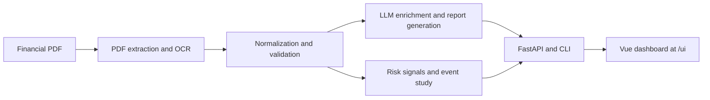

# Jetbot

Jetbot is a financial report analysis platform that turns PDF filings into structured financial statements, key notes, risk signals, event-study outputs, and trader-style summaries. It combines PDF extraction, validation, LLM orchestration, a FastAPI backend, and a Vue dashboard in one repository.

It is designed for teams that need a single workflow to ingest reports, inspect extracted evidence, and ship the results through an API, a CLI, or a browser UI.

## Highlights

- End-to-end PDF pipeline for raw text, tables, statements, notes, and report generation.
- Works in mock mode out of the box, with optional OpenAI and Anthropic model routing.
- Vue 3 dashboard for reviewing original PDFs alongside extraction and analysis outputs.
- Docker-first local stack with API, worker, Redis, PostgreSQL, and MinIO.
- Pluggable storage, retrieval, tracing, and market-data integrations.
- Production-friendly defaults for auth, rate limiting, metrics, and tracing.

## Architecture



## Quick Start

### Option 1: Local development

Use this path when you want the fastest edit-run loop.

```bash
python -m venv .venv
# activate the virtual environment for your shell
pip install -e .
make dev
```

The API starts at `http://127.0.0.1:8000`.

If you want the Vue frontend in dev mode as well:

```bash
make web-install
make web-dev
```

The Vite app runs at `http://127.0.0.1:5173` and proxies API requests to the local backend.

### Option 2: Full Docker stack

Use this path when you want the full local system with background worker and infrastructure services.

```bash
copy .env.example .env
make docker-up
```

`make docker-up` now does four things in one flow:

- builds the backend image with the Vue production bundle included
- starts the API, worker, Redis, PostgreSQL, and MinIO services
- waits until the API health endpoint is ready
- opens the frontend automatically at `http://127.0.0.1:8000/ui/`

Set `JETBOT_OPEN_BROWSER=0` if you want to skip the automatic browser launch.

Stop the stack with:

```bash
make docker-down
```

## What You Get

After startup, the main entry points are:

| Surface | URL / Command | Notes |
| --- | --- | --- |
| Web UI | `http://127.0.0.1:8000/ui/` | Review uploaded PDFs, tables, statements, signals, and generated reports |
| API | `http://127.0.0.1:8000/v1` | Programmatic ingestion and retrieval |
| OpenAPI docs | `http://127.0.0.1:8000/docs` | Interactive API explorer |
| Health | `http://127.0.0.1:8000/health` | Liveness probe |
| Metrics | `http://127.0.0.1:8000/metrics` | Prometheus endpoint |
| CLI | `python -m src.cli --help` | Local automation and scripting |

## Common Workflows

### Analyze a PDF from the CLI

```bash
python -m src.cli analyze --pdf path/to/report.pdf --out data --company "Example Co" --period-end 2025-12-31
```

### Run the bundled real-PDF example

```bash
python examples/real_pdf_analysis/run_example.py
```

### Call the API directly

```bash
curl -F "file=@path/to/report.pdf" \
  -H "X-API-Key: your-key" \
  http://127.0.0.1:8000/v1/documents

curl -X POST \
  -H "X-API-Key: your-key" \
  http://127.0.0.1:8000/v1/documents/<doc_id>/analyze
```

## Configuration

Jetbot starts in mock mode if no provider key is configured. Most teams only need a small set of environment variables to get productive:

| Variable | Purpose | Default |
| --- | --- | --- |
| `OPENAI_API_KEY` | Enable OpenAI-backed extraction and reporting | empty |
| `ANTHROPIC_API_KEY` | Enable Anthropic-backed models | empty |
| `LLM_DEFAULT_MODEL` | Default router target in `provider:model` format | empty |
| `LLM_EXTRACTION_MODEL` | Override the extraction model | empty |
| `LLM_REPORT_MODEL` | Override the reporting model | empty |
| `RAG_MODE` | Retrieval mode: `token_overlap`, `embedding`, `hybrid` | `token_overlap` |
| `TASK_BACKEND` | `background` or `celery` | `background` |
| `STORAGE_BACKEND` | `local` or `postgres` | `local` |
| `API_KEYS` | Comma-separated API keys; blank disables auth | empty |
| `JETBOT_API_PORT` | Host port for the Dockerized API/UI | `8000` |

See `.env.example` for the full configuration surface, including tracing, storage, port overrides, rate limiting, and market-data settings.

## Optional Capability Packs

Install only the packages you need:

```bash
pip install -e ".[embeddings]"
pip install -e ".[anthropic]"
pip install -e ".[celery]"
pip install -e ".[postgres]"
pip install -e ".[s3]"
pip install -e ".[market]"
pip install -e ".[monitoring]"
pip install -e ".[all]"
```

## Development

```bash
make test
make eval
make fmt
make lint
make typecheck
make web-lint
make web-build
```

The repository is organized around a small number of clear surfaces:

- `src/api/` for HTTP entry points and application wiring
- `src/pdf/` for extraction, rendering, tables, and OCR
- `src/finance/` for schemas, normalization, validation, and signal logic
- `src/agent/` for pipeline orchestration and state handling
- `src/market/` for event-study analysis and market providers
- `web/` for the Vue 3 dashboard
- `tests/` for API, storage, pipeline, frontend-adjacent, and integration coverage
- `docs/` for architecture, branch protection, and project notes

## Contributing

All changes land through pull requests.

```bash
git checkout -b feat/<short-description>
bash scripts/local_ci.sh
git push -u origin HEAD
gh pr create --base main --fill
```

Before opening a PR, make sure local CI passes. The script covers Python linting, typing, tests, and the web checks that mirror CI.

See `CONTRIBUTING.md`, `CODE_OF_CONDUCT.md`, `SECURITY.md`, and `docs/BRANCH_PROTECTION.md` for project policy and contribution details.

## License

MIT. See `LICENSE`.

## Not Financial Advice

Jetbot produces structured extraction and analytical signals. It does not provide investment advice or recommend trades.